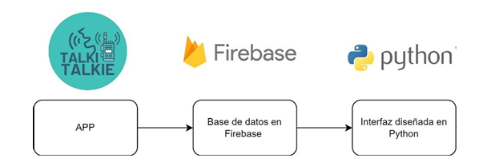

# 📊 Talkie-Talkie Database & App

[](LICENSE)


> Thesis project (2024) combining the development of an **Android application**, a **Firebase database**, and a **Python data analysis module**.  
> The goal was to design a system to **store, query, and visualize user information in real time**, integrating mobile technologies with data science.

---

## 🚀 Technologies Used
- **Android (Gradle, Java)** – mobile app development  
- **Firebase** – authentication and cloud storage  
- **Python (pandas, numpy, matplotlib, jupyter)** – data analysis and visualization  
- **SQL** – queries and reporting  

---

## 📂 Repository Structure
```
android_app/    → Android project (Gradle, app/, gradle/, build.gradle…)
analysis/       → Jupyter notebooks (e.g., Analisis_BaseD.ipynb)
visualization/  → Python scripts (e.g., VisualizBD.py)
data/           → Sample data (non-sensitive)
results/        → Generated charts and outputs
docs/           → Thesis PDF and screenshots
config/         → Configuration files (Firebase example)
```

---

## ⚙️ How to Run the Project

### 📱 Android (app)
1. Open the `android_app/` folder in **Android Studio**.  
2. Sync dependencies (Gradle will download automatically).  
3. Build and run on an emulator or physical device:
   ```bash
   ./gradlew assembleDebug
   ```
   On **Windows**:
   ```bash
   gradlew.bat assembleDebug
   ```

### 🐍 Python (analysis & visualization)

1. Create a virtual environment:
   ```bash
   python -m venv .venv
   ```

2. Activate the environment:
   - **Windows**:
     ```bash
     .venv\Scripts\activate
     ```
   - **Linux/Mac**:
     ```bash
     source .venv/bin/activate
     ```

3. Install dependencies:
   ```bash
   pip install -r requirements.txt
   ```

4. Open the main notebook:
   ```bash
   jupyter notebook analysis/Analisis_BaseD.ipynb
   ```

5. Run the visualization script:
   ```bash
   python visualization/VisualizBD.py
   ```

---

## 🔐 Firebase Configuration
- The file `config/firebase-config-example.json` is provided as a template.  
- To run the project, create your own `firebase-config.json` in the `config/` folder with your Firebase credentials.  
- This file is excluded from Git for security reasons.  

---

## 📊 Results
- Mobile app to **register and query users** in real time.  
- **Firebase integration** for authentication and cloud storage.  
- Python modules for **data exploration and visualization**.  
### 🖼️ System Architecture
The diagram below illustrates how the Android app, Firebase database, and Python module interact:


---

## 📑 Documentation
The complete thesis is available here:  
[`docs/DocumentoFinal_Talkie_Talkie_2024_TG.pdf`](docs/DocumentoFinal_Talkie_Talkie_2024_TG.pdf)

---


